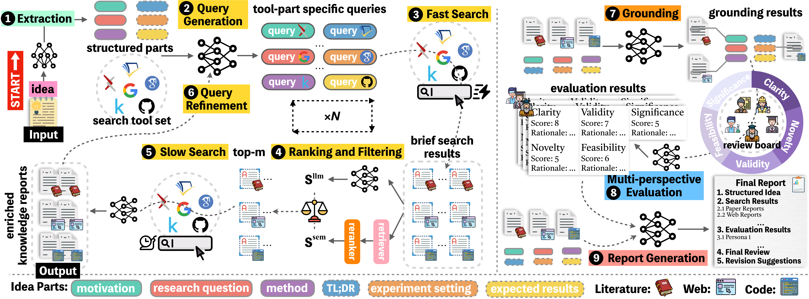

<div align="center">
  <h1>InnoEval: An Automated Framework for Research Idea Evaluation</h1>
</div>
<p align="center">
  <a href="https://github.com/zjunlp/InnoEval">
  	
  </a>
  <a href="https://github.com/zjunlp/InnoEval/blob/main/LICENSE">
    
  </a>
  
  
</p>


<h5 align="center"> If you like our project, please give us a star on GitHub for the latest updates!</h5>

---



**InnoEval** is an automated evaluation framework designed for assessing research ideas and innovation proposals. It leverages multi-agent systems and LLMs to comprehensively evaluate the novelty, feasibility, and significance of research contributions.

* **Multi-Agent Pipeline**
  <br> A chain of specialized agents (Extraction, Research, Grounding, Evaluation, Report) working together

* **Multi-Source Grounding**
  <br> Gathers evidence from web pages, code repositories, and academic papers to validate claims

* **Persona-Based Evaluation**
  <br> Simulates multiple reviewer perspectives for balanced and comprehensive assessment

* **Flexible Input Modes**
  <br> Supports both PDF URLs and direct text input for research ideas

* **Batch Processing**
  <br> Point-wise and group-wise evaluation for large-scale dataset analysis


## Table of Contents

* [📥 Installation](#📥-installation)
* [🎬 Quick Start](#🎬-quick-start)
* [📂 Architecture](#📂-architecture)
* [🔬 Examples](#🔬-examples)
* [🛠 Configuration](#🛠-configuration)
* [📄 Acknowledgement](#📄-acknowledgement)
* [✍️ Citation](#✍️-citation)


## 📥 Installation

### 1. Clone the Repository

```bash
git clone https://github.com/your-org/InnoEval.git
cd InnoEval
```

### 2. Create Virtual Environment

```bash
conda create -n innoeval python=3.10 -y
conda activate innoeval
```

### 3. Install Dependencies

```bash
pip install -r requirements.txt
```

### 4. Configure API Keys

Copy the example configuration file and fill in your API keys:

```bash
cd config/
cp LLM.env.example LLM.env
# Edit LLM.env with your API keys
```

Required API keys:
| Key | Description |
|-----|-------------|
| `DS_API_KEY` | DeepSeek API key (primary LLM) |
| `DS_API_BASE_URL` | DeepSeek API base URL |
| `OPENAI_API_KEY` | OpenAI API key (optional) |
| `GOOGLE_API_KEY` | Google Search API key |
| `SERPER_API_KEY` | Serper API key for web search |
| `JINA_API_KEY` | Jina API key for content extraction |
| `S2_API_KEY` | Semantic Scholar API key |
| `GH_TOKEN` | GitHub token for repository analysis |


## 🎬 Quick Start

### 1. Single Idea Evaluation

Run the complete pipeline for a single research idea:

```bash
cd InnoEval
python3 -m innoeval.pipeline.single_idea_pipeline
```

This executes the full 6-step pipeline:
1. **ExtractionAgent**: Extract structured idea from PDF/text
2. **ResearchAgent**: Search for related works (web, code, papers)
3. **Report Extraction**: Build evidence reports from search results
4. **GroundingAgent**: Map claims to supporting evidence
5. **EvaluationAgent**: Multi-perspective quality assessment
6. **ReportAgent**: Generate final evaluation report

### 2. Point-wise Dataset Evaluation

Evaluate an entire dataset of research papers:

```bash
python3 -m innoeval.pipeline.batch_pipeline
```

Results are saved to `cache/dataset_conference_points/`.

### 3. Group Dataset Evaluation

Process papers organized in groups:

```bash
python3 -m innoeval.pipeline.group_pipeline
```

Results are saved to `cache/dataset_conference_groups/`.

### 4. Group/Pair Evaluation

Run comparison evaluation on cached group results:

```bash
# Group-wise comparison and ranking
python3 -m innoeval.pipeline.group_evaluation

# Pair-wise comparison
python3 -m innoeval.pipeline.pair_evaluation
```

These scripts read from `cache/dataset_conference_groups/` and do not re-run the pipeline.


## 📂 Architecture

### Directory Structure

```
InnoEval/
├── config/                     # Configuration files
│   ├── LLM.env                 # API keys (not tracked)
│   ├── LLM.env.example         # Example configuration
│   └── kaggle.json             # Kaggle API config
├── dataset/                    # Evaluation datasets
│   ├── conference_points.jsonl # Point-wise dataset
│   ├── conference_groups.json  # Group-wise dataset
│   └── conference_pairs_*.json # Pair datasets
├── cache/                      # Pipeline results cache
│   └── reviewer_personas.json  # Reviewer personas
└── innoeval/                   # Main package
    ├── mas/                    # Multi-Agent System
    │   ├── agents/             # Agent implementations
    │   │   ├── extraction_agent.py
    │   │   ├── research_agent.py
    │   │   ├── grounding_agent.py
    │   │   ├── evaluation_agent.py
    │   │   └── report_agent.py
    │   ├── models/             # LLM and model interfaces
    │   │   ├── model_factory.py
    │   │   └── bge_singleton.py
    │   └── tools/              # Utility tools
    │       ├── searchers/      # Web/code/paper search
    │       ├── querygen/       # Query generation
    │       ├── enricher/       # Content enrichment
    │       ├── grobid_refs/    # Reference extraction
    │       └── repo_analysis/  # GitHub repo analysis
    └── pipeline/               # Pipeline implementations
        ├── single_idea_pipeline.py
        ├── batch_pipeline.py
        ├── group_pipeline.py
        ├── group_evaluation.py
        └── pair_evaluation.py
```

### Pipeline Workflow

```
┌─────────────────┐    ┌─────────────────┐    ┌─────────────────┐
│  Input: PDF URL │───▶│ ExtractionAgent │───▶│   Idea Object   │
│  or Text Input  │    │   (Extract)     │    │  (structured)   │
└─────────────────┘    └─────────────────┘    └────────┬────────┘
                                                       │
                                                       ▼
┌─────────────────┐    ┌─────────────────┐    ┌─────────────────┐
│   Web Pages     │    │  ResearchAgent  │───▶│  SearchResults  │
│   Code Repos    │◀───│    (Search)     │    │   (enriched)    │
│   Papers        │    └─────────────────┘    └────────┬────────┘
└─────────────────┘                                     │
                                                        ▼
┌─────────────────┐    ┌─────────────────┐    ┌─────────────────┐
│   Claims Map    │◀───│ GroundingAgent  │◀───│  Reports Data   │
│  (evidence)     │    │   (Grounding)   │    │  (extracted)    │
└────────┬────────┘    └─────────────────┘    └─────────────────┘
         │
         ▼
┌─────────────────┐    ┌─────────────────┐    ┌─────────────────┐
│   Personas      │───▶│EvaluationAgent  │───▶│ EvaluationResult│
│  (reviewers)    │    │   (Evaluate)    │    │   (per-persona) │
└─────────────────┘    └─────────────────┘    └────────┬────────┘
                                                       │
                                                       ▼
                                              ┌─────────────────┐
                                              │  ReportAgent    │
                                              │  (Synthesize)   │
                                              └────────┬────────┘
                                                       │
                                                       ▼
                                              ┌─────────────────┐
                                              │  Final Report   │
                                              │  (Markdown)     │
                                              └─────────────────┘
```

### Evaluation Dimensions

The framework evaluates research ideas across five core dimensions:

| Dimension | Description |
|-----------|-------------|
| **Clarity** | How clearly the idea is presented and explained |
| **Novelty** | Originality and innovation compared to existing work |
| **Validity** | Soundness of methodology and theoretical foundations |
| **Feasibility** | Practical implementability with available resources |
| **Significance** | Potential impact and contribution to the field |

Custom evaluation metrics can be added through the `user_metric` parameter.


## 🔬 Examples

### Example 1: Evaluate from PDF URL

```python
import asyncio
from pathlib import Path
from innoeval.pipeline.single_idea_pipeline import SingleIdeaPipeline

async def evaluate_paper():
    pipeline = SingleIdeaPipeline(
        input_type="pdf",
        pdf_url="https://openreview.net/pdf?id=YOUR_PAPER_ID",
        cache_path=Path("cache/my_paper.json"),
        persona_path=Path("cache/reviewer_personas.json"),
        research_params={
            "title": "Your Paper Title",
            "after": "2022-01-01",
            "before": "2024-01-01",
            "depth": 3,
        },
        num_personas=5,
        get_future_paper=True,
    )
    result = await pipeline.run()
    print(result["final_report"])

asyncio.run(evaluate_paper())
```

### Example 2: Evaluate from Text

```python
import asyncio
from pathlib import Path
from innoeval.pipeline.single_idea_pipeline import SingleIdeaPipeline

async def evaluate_idea():
    idea_text = """
    This paper introduces a novel approach to automated code review
    using large language models with retrieval-augmented generation...
    """

    pipeline = SingleIdeaPipeline(
        input_type="text",
        idea_text=idea_text,
        cache_path=Path("cache/my_idea.json"),
        research_params={
            "title": "LLM-based Code Review",
            "after": "2023-01-01",
            "before": "2024-12-01",
        },
        num_personas=3,
    )
    result = await pipeline.run()
    print(result["final_decision"])

asyncio.run(evaluate_idea())
```

### Example 3: Custom Evaluation Metrics

```python
# The evaluation agent supports custom metrics
eval_params = {
    "temperature": 0.7,
    "user_metric": [
        {
            "metric": "Reproducibility",
            "description": "Evaluate whether sufficient detail is provided for reproduction"
        },
        {
            "metric": "EthicalConsiderations",
            "description": "Assess potential ethical implications and mitigation strategies"
        }
    ]
}
```

### Example 4: Batch Processing with Custom Dataset

```python
# Create a JSONL file with format:
# {"paper_id": "xxx", "title": "...", "decision": "accept"}
# Then run:
# python3 -m innoeval.pipeline.batch_pipeline

# Or programmatically:
from innoeval.pipeline.batch_pipeline import load_dataset, process_paper

items = load_dataset(Path("dataset/my_papers.jsonl"), num=10)
for item in items:
    print(f"Processing: {item.title}")
```


## 🛠 Configuration

### LLM Configuration

The `config/LLM.env` file controls all API settings:

```bash
# Primary LLM (DeepSeek)
DS_API_KEY=your_deepseek_key
DS_API_BASE_URL=https://api.deepseek.com/v1

# OpenAI (alternative)
OPENAI_API_KEY=your_openai_key
OPENAI_API_BASE_URL=https://api.openai.com/v1

# Search APIs
GOOGLE_API_KEY=your_google_key
SERPER_API_KEY=your_serper_key
JINA_API_KEY=your_jina_key
S2_API_KEY=your_semantic_scholar_key

# GitHub
GH_TOKEN=your_github_token

# Kaggle (optional)
KAGGLE_CONFIG_DIR=./config
```

### Model Configuration

The default model configuration in `SingleIdeaPipeline`:

```python
model_config = {
    "models": {
        "default_provider": "dsr1",
        "dsr1": {
            "model_name": "deepseek-v3.2",
            "api_key": os.getenv("DS_API_KEY"),
            "base_url": os.getenv("DS_API_BASE_URL"),
            "max_tokens": 4096,
            "temperature": 0.7,
        },
    }
}
```

### Agent Parameters

| Agent | Key Parameters |
|-------|----------------|
| **ExtractionAgent** | `extract_temperature: 0.3` |
| **ResearchAgent** | `top_k: 10`, `max_results_per_query: 5`, `web_max_results: 5`, `github_max_results: 5` |
| **GroundingAgent** | `extract_temperature: 0.0` |
| **EvaluationAgent** | `temperature: 0.7`, `num_personas: 5` |
| **ReportAgent** | `temperature: 0.4` |

### Research Parameters

| Parameter | Type | Description |
|-----------|------|-------------|
| `title` | str | Paper title for search optimization |
| `after` | str | Search papers after this date (YYYY-MM-DD) |
| `before` | str | Search papers before this date (YYYY-MM-DD) |
| `depth` | int | Search depth (1-5) |
| `web_temperature` | float | Temperature for web search queries |
| `code_temperature` | float | Temperature for code search queries |

### Cache Structure

Pipeline results are cached in JSON format:

```json
{
  "extraction_result": {...},
  "search_results_dict": {...},
  "reports_data": {...},
  "grounding_result": {...},
  "evaluation_result": {...},
  "final_report": "...",
  "final_decision": "accept/reject",
  "total_time": 123.45,
  "total_token": 50000
}
```


## 📄 Acknowledgement

This project builds upon and draws inspiration from the following open-source projects:

### InternAgent
We thank the [InternAgent](https://github.com/InternScience/InternAgent) project for providing foundational multi-agent architecture patterns and evaluation methodologies that influenced our pipeline design.

### RepoMaster
We thank [RepoMaster](https://github.com/QuantaAlpha/RepoMaster) for the repository analysis toolkit that enables comprehensive code repository evaluation in our grounding process.

---


## ✍️ Citation

If you find our work helpful, please use the following citations.

```

```

### License

This project is licensed under the MIT License - see the [LICENSE](LICENSE) file for details.
